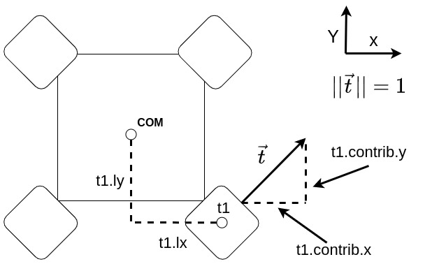

# steelhead_controls

## Description

This package contains the nodes related to the control system.

## Usage

### Arduino

These are sketeches to be uploaded on the board holding the sensors for communication with the main computer. For information on how the onboard computer should be configured, check the [Notion guide](https://app.notion.com/p/subbots/Hardware-Guide-connecting-to-AUV-1be8c60b4369804ba01ad3bc5f43e8bc).

- `bno085_serial_output_parser`: For the BNO085 IMU. Uploaded onto the Qtpy, sends imu information over USB serial (this should be renamed as /dev/imu.) Streams CSV lines of `status,qx,qy,qz,qw,ax,ay,az` — the orientation quaternion in the BNO085's native i,j,k,real order plus linear acceleration.
- `ms5837_depth_sensor`: For the MS5837 depth sensor, most likely aboard the Bar02 pressure sensor from Blue Robotics. Currently communnicates over UART on the onboard 2040 chip on the Radxa X4 (this should be renamed as /dev/depth).

### Thrust Allocation

To launch the `thrust_allocator` node, use the following command

    ros2 launch steelhead_controls thrust_allocator_launch.py

You can change the configuration file for the `thrust_allocator` in the launch file, just be sure that the configuration file you want to use exists in `steelhead_controls/config`.

### Waypoint Marker

To run the waypoint marker node, run

        ros2 launch steelhead_controls waypoint_marker_launch.py

### Trajectory Generator

To run the Trajectory Generator node, run

        ros2 launch steelhead_controls trajectory_generator_launch.py

## Nodes

- `thrust_allocator` : A standalone node which subscribes to the desired forces and torques to act upon the AUV and publishes an array which contains the allocated forces and associated PWM signals given to each thruster based on the config file passed in on launch

  ### Subscribed Topics

  - `controls/input_forces` (`geometry_msgs/msg/Wrench.msg`) : Input forces and torques

  ### Published Topics

  - `controls/output_forces` (`std_msgs/msg/Float64MultiArray.msg`) : Forces corresponding to each thruster
  - `controls/signals` (`std_msgs/msg/Float64MultiArray.msg`): PWM signals corresponding to each thruster

  ### Parameters (defined in thruster_config.yaml)

  - `num_thrusters` (`int32`): The number of thrusters in the configuration
  - `ti.contrib.x/y/z` (`float32`): The x/y/z-axis contribution of thruster `i`
  - `ti.lx/ly/lz` (`float32`): The x/y/z-length of thruster `i` from the AUV's centre of mass
  - `ti.help.x/y/z` (`float32`): How much thruster `i` spins when given an x/y/z force (used for irregular thruster placements)

  ### Notes

  - In the config file, you MUST define the thrusters `t1,...,tn` in the config file where `n = num_thrusters`. See the config file for examples of this configuration
  - You can currently only configure up to **6** thrusters.
  - In the `config.yaml`, the root key must be the full name of the node being configured
  - Here is a diagram showing how to parameterize a thruster (assume it's in the `z = 0` plane of the centre of mass)
      
    Be aware that in this example `t1.ly` would be negative, `t1.lx` would be positive, and `t1.contrib.x`, `t1.contrib.y` would both also be positive.

- `waypoint_marker` : A standalone node that monitors whether a set waypoint has been achieved, and publishes waypoint information and error to target.

  ### Subscribed Topics

  - `controls/ukf/odometry/filtered` (`nav_msgs/Odometry`) : AUV state
  - `controls/waypoint_marker/set` (`steelhead_interfaces/Waypoint`) : Target waypoint

  ### Published Topics

  - `controls/waypoint_marker/current_goal` (`steelhead_interfaces/Waypoint`) : Current target waypoint
  - `controls/input_pose` (`geometry_msgs/Pose`) : Error to target pose. For navigation.

  ### Notes

  - Initially, no goal is set.
  - When a goal is set, the waypoint marker continuously monitors AUV state to determine whether the goal is achieved
    - If a goal is set, attempts to set the same goal is ignored
    - After a goal is achieved, it returns to the 'no goal' state
    - Success is determined by the 'current_goal' topic, in the 'success' field of the waypoint messages
  - When no goal is set, Poses with all zeros are published to the 'input_pose' topic, indicating that the AUV should not move

- `trajectory_generator` : A standalone node that generates a set of waypoints based on current pose, destination pose, and trajectory type.

  ### Subscribed Topics

  - `controls/ukf/odometry/filtered` (`nav_msgs/Odometry`) : AUV state
  - `controls/waypoint_marker/current_goal` (`steelhead_interfaces/Waypoint`) : Current target waypoint
  - `controls/trajectory_generator/set` (`steelhead_interfaces/ObjectOffset`) : Current destination and object type
  - `controls/trajectory_generator/set_type` (`steelhead_interfaces/TrajectoryType`) : Current trajectory type

  ### Published Topics

  - `controls/waypoint_marker/set` (`steelhead_interfaces/Waypoint`) : Set current target waypoint

  ### Notes

  - Initially, trajectory type is 'START'. It publishes a waypoint that is always +0.5 rad in yaw of the current pose, causing the AUV to turn around slowly.
  - Other nodes (e.g. the Mission Planner) decide when to start the next stage, and change trajectory type to 'GATE'
  - When trajectory type is 'GATE', the trajectory generator sets the gate pose to be the destination pose
    - More specifically, it gets the AUV to turn towards the gate and move forward, as well as manage the depth
    - TODO: make an actual trajectory

- `bno085_imu_publisher` : A Python node for launching the BNO085 IMU on Steelhead. Reads `status,qx,qy,qz,qw,ax,ay,az` CSV lines from `/dev/imu` (see `bno085_serial_output_parser`), renormalizes the quaternion and republishes it as a `sensor_msgs/Imu`.

  ### Published Topics

  - `/steelhead/drivers/imu/out` (`sensor_msgs/Imu`) : Orientation of the IMU (and by extension Steelhead.)

  ### Notes

  - !TODO The publish topic is temporary, and should not have the steelhead/drivers namespace, which should be assigned in the launch file instead.

- `hover_at_depth` : A node that keeps the robot upright at a certain depth from the surface of the water.

  ### Subscribed Topics

  - `drivers/imu/out` (`sensor_msgs/Imu`) : Orientation of the IMU (and by extension Steelhead.)
  - `drivers/depth_sensor` (`steelhead_interfaces/msg/DepthSensor`) : Contains depth, pressure and temperature. Depth is the only value used.
  - `controls/hover_adjust` (`steelhead_interfaces/msg/HoverAdjustment`) : Optionally uses input forces for navigating while hovering and keeping upright. If partial adjustment is configured, only yaw (if toggled) and x and y force should be adjusted, as other adjustments are handled by the hover script. Otherwise, full overrides essentially shut down the hover functionality.

  ### Published Topics

  - `controls/input_pose` (`geometry_msgs/Pose`) : Error to target pose for the PID controller.

  ### Notes

  - A target depth to maintain is expected as input to the node via the `depth` parameter, but a default value of 0.5m will be assigned if not specified. If a negative value or zero is provided, it's assumed that depth should not be considered and the script will only adjust for orientation.
  - If desired, yaw can be adjusted via the `hold_yaw` parameter. This is defaulted to false if not provided, since it's unusual for yaw to be controlled via pid.
  - Adjustments published to hover_adjust should terminate with a zeroed wrench when finished, else it will continue onward. The final message should also be a partial adjustment.

## Services

- `actuators_command` : A service for communicating with the actuators enclosure. Expects certain strings defined on the arduino to operate.

  ### Serviced Topics

  - `actuators_command` (`string`) : Actuator command.

  ### Notes

  - To utilize this service, remember to start it up using `actuators_command_server_launch.py`.
  - This system relies on an arduino connected to `/dev/arduino` with a baud rate of 115200.
  - The service will respond with the status of whether or not writing the serial communication was successful or not.
  - There are preset commands that the Ardunio board expects set as enumerations in `src/steelhead_interfaces/srv/ActuatorsCommand.srv`. These are defined in the `ardunio` repository in `ubc-subbots`.

## Launch Files

- `cameras_publisher_launch.py`: Starts the nodes neccessary to utilize the usb cameras onboard Steelhead.

    - The cameras are configured with the config files `cameraX.yaml`.

## Contributors

- Logan Fillo (logan.fillo@gmail.com)
- Jared Chan (jaredchan42@gmail.com)
- Dorson Tang (dorsontang123@gmail.com)
